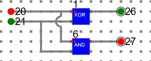
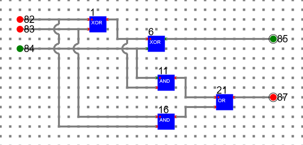
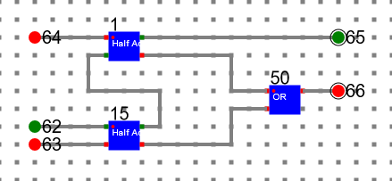
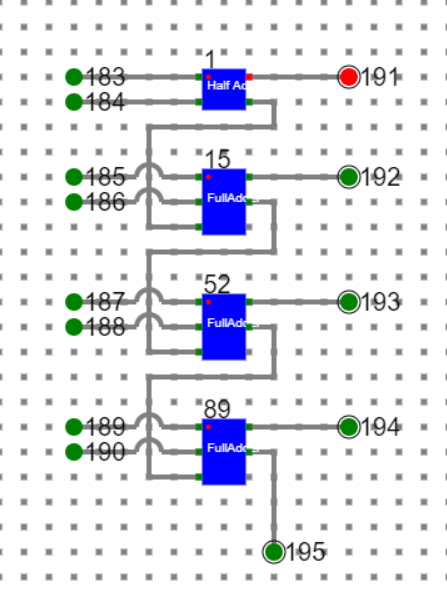

# Assignment Statements :
- Create a half adder circuit using only logic gates and test it by giving proper input.
- Create a full adder circuit using only logic gates and test it by giving proper input.
- Create a full adder circuit using half adder and test it by giving proper input.
- Create a 4-bit ripple carry adder circuit using half adders and full adders and test it by giving proper input.

# Circuit diagram of Ripple Carry Adder:

# Procedure

- To draw any diagram in the simulator please follow the manual given in manual section.

1.	Half Adder with ‘XOR’ and ‘AND’ gates readily available in the simulator.

where 

**20, 21: Input bits**

**26: Sum**

**27: Carry**

- This could be saved as a component with suitable name – say **‘HalfAdder’**.

2.	Full Adder with ‘XOR’, ‘AND’ and ‘OR’ gates readily available in the simulator.

where 

**82, 83: Input Bits**

**84: Carry-In**

**85: Sum**

**87: Carry-Out**

3.	Full Adder with the help of Half Adders (Designed Above) and ‘OR’ gate

where 

**1, 15: Half Adders**

**62, 63: Input Bits**

**64: Carry-In**

**65: Sum**

**66: Carry Out**

- This could be saved as a component with suitable name – say **‘FullAdder’**.
 		
4.	Ripple Carry Adder with 1 half adder and 3 full adders

 
- **1: Half Adder** and **15, 52, 89: Full Adder**
- First 4 bit number represented by **183(LSB), 185, 187 and 189(MSB)** and second 4 bit number represented by **184 (LSB), 186, 188, 190 (MSB)**.
- The output number after sum is **191 (LSB), 192, 193, 194 (MSB)**.
- Final carry-out is **195**.

## Follow the below manual and perform the experiment

- Manual --> [Click Here](./simulation/coavlNew.pdf)

<embed src="./simulation/coavlNew.pdf" type="application/pdf">

