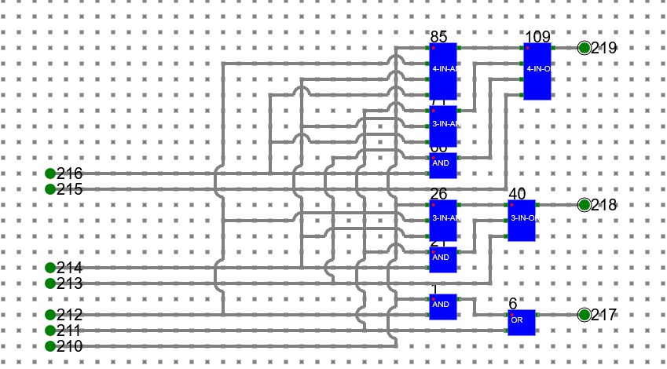

# Assignment Statements for Ripple Carry Adder:
- Create a half adder circuit using only logic gates and test it by giving proper input.
- Create a full adder circuit using only logic gates and test it by giving proper input.
- Create a full adder circuit using half adder and test it by giving proper input.
- Create a 4-bit ripple carry adder circuit using half adders and full adders and test it by giving proper input.

# Circuit diagram of Ripple Carry Adder:

# Procedure

- To draw any diagram in the simulator please follow the manual given in manual section.

1.	Half Adder with ‘XOR’ and ‘AND’ gates readily available in the simulator.

where 

**20, 21: Input bits**

**26: Sum**

**27: Carry**

- This could be saved as a component with suitable name – say **‘HalfAdder’**.

2.	Full Adder with ‘XOR’, ‘AND’ and ‘OR’ gates readily available in the simulator.

where 

**82, 83: Input Bits**

**84: Carry-In**

**85: Sum**

**87: Carry-Out**

3.	Full Adder with the help of Half Adders (Designed Above) and ‘OR’ gate

where 

**1, 15: Half Adders**

**62, 63: Input Bits**

**64: Carry-In**

**65: Sum**

**66: Carry Out**

- This could be saved as a component with suitable name – say **‘FullAdder’**.
 		
4.	Ripple Carry Adder with 1 half adder and 3 full adders

 
- **1: Half Adder** and **15, 52, 89: Full Adder**
- First 4 bit number represented by **183(LSB), 185, 187 and 189(MSB)** and second 4 bit number represented by **184 (LSB), 186, 188, 190 (MSB)**.
- The output number after sum is **191 (LSB), 192, 193, 194 (MSB)**.
- Final carry-out is **195**.

# Assignment Statements for Carry-Lookahead Adder:

- Create a full adder circuit using basic logic gates and test it by giving proper input.
- Create a Pi-Gi generator circuit using basic logic gates and test it by giving proper input.
- Create 3 input AND gate, 3 input OR gate, 4 input AND gate, 4 input OR gates using basic logic gates and test it by giving proper input.
- Create a carry generator using above GATEs and test it with proper input
- Create a 4-bit carry lookahead adder circuit using Pi-Gi generator, carry generator and Full Adders.

# Procedure

To draw any diagram in the simulator, please follow the instructions given in the manual.
1.	Create a Pi-Gi generator as shown below. For Pi-Gi, please refer to the theory section. Save this as a component, say pi-gi.

#### Pi-Gi generator

where

**24: Ai,** &emsp; **25: Bi** &emsp; **26: Pi** &emsp; **27: Gi**

2.	Create carry generator as shown in the picture below using basic AND gate, basic OR gate, 3 input AND, 3 input OR, 4 input AND, 4 input OR gates and save it as a component say c-gen.

#### Carry Generator for 4 bit carry-lookahead adder

 
 where 

**210: C1,** &emsp; **211: G1,** &emsp; **212: P1,** &emsp; **213: G2,** &emsp; **214: P2,** &emsp; **215: G3,** &emsp; **216: P3,** &emsp; **217: C2,** &emsp; **218: C3,** &emsp; **219: C4**

3.	Create a 4 bit carry lookahead adder as shown below using Pi-Gi generator, c-gen and 1 bit Full Adder.

#### 4-bit carry-lookahead adder

        

**395: Cin,** &emsp; **387: A1,** &emsp; **388: B1,** &emsp; **389: A2,** &emsp; **390: B2,** &emsp; **391: A3,** &emsp; **392: B3,** &emsp; **393: A4,** &emsp; **394: B4,** &emsp; **396: S1,** &emsp; **397: S2,** &emsp; **398: S3,** &emsp; **399: S4** &emsp; 

**448: S5 [A1, B1: LSB   A4, B4: MSB S1: LSB, S5: MSB]**

## Follow the below manual and perform the experiment

- Manual --> [Click Here](./simulation/coavlNew.pdf)

<embed src="./simulation/coavlNew.pdf" type="application/pdf">

