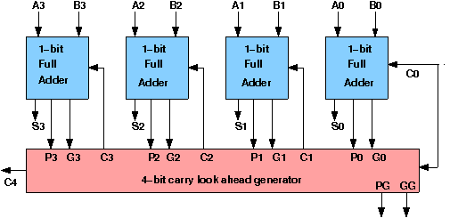

# Theory:

## Design of Ripple Carry Adders :

Arithmetic operations like addition, subtraction, multiplication, division are basic operations to be implemented in digital computers using basic gates like AND, OR, NOR, NAND etc. Among all the arithmetic operations if we can implement addition then it is easy to perform multiplication (by repeated addition), subtraction (by negating one operand) or division (repeated subtraction).

Half Adders can be used to add two one bit binary numbers. It is also possible to create a logical circuit using multiple full adders to add N-bit binary numbers.Each full adder inputs a **Cin**, which is the ***Cout*** of the previous adder. This kind of adder is a ***Ripple Carry Adder***, since each carry bit **"ripples"** to the next full adder. The first (and only the first) full adder may be replaced by a half adder.The block diagram of 4-bit Ripple Carry Adder is shown here below -

The layout of ripple carry adder is simple, which allows for fast design time; however, the ripple carry adder is relatively slow, since each full adder must wait for the carry bit to be calculated from the previous full adder. The gate delay can easily be calculated by inspection of the full adder circuit. Each full adder requires three levels of logic.In a 32-bit [ripple carry] adder, there are 32 full adders, so the critical path (worst case) delay is 31 * 2(for carry propagation) + 3(for sum) = 65 gate delays.

## Design Issues :

The corresponding boolean expressions are given here to construct a ripple carry adder. In the half adder circuit the sum and carry bits are defined as

    Sum = A ⊕ B

    Carry = AB

In the full adder circuit the Sum and Carry output is defined by inputs A, B and Carryin as

    Sum = ABC + ABC + ABC + ABC

    Carry = ABC + ABC + ABC + ABC

Having these we could design the circuit.But,we first check to see if there are any logically equivalent statements that would lead to a more structured equivalent circuit.

With a little algebraic manipulation,one can see that

    Sum = ABC + ABC + ABC + ABC

        = (AB + AB) C + (AB + AB) C

        = (A ⊕ B) C + (A ⊕ B) C

        = A ⊕ B ⊕ C

    Carry = ABC + ABC + ABC + ABC

          = AB + (AB + AB) C

          = AB + (A ⊕ B) C

# Carry-Lookahead Adder

## Design of Carry-Lookahead Adders:
To reduce the computation time, there are faster ways to add two binary numbers by using carry-lookahead adders. They work by creating two signals P and G known to be **Carry Propagator** and **Carry Generator**. The carry propagator is propagated to the next level whereas the carry generator is used to generate the output carry, regardless of input carry. The block diagram of a 4-bit Carry-Lookahead Adder is shown here below -
 

The number of gate levels for the carry propagation can be found from the circuit of full adder. The signal from input carry Cin to output carry Cout requires an AND gate and an OR gate, which constitutes two gate levels. So if there are four full adders in the parallel adder, the output carry C5 would have 2 X 4 = 8 gate levels from C1 to C5. For an n-bit parallel adder, there are 2n gate levels to propagate through.

## Design Issues:

The corresponding Boolean expressions are given here to construct a carry-lookahead adder. In the carry-lookahead circuit we ned to generate the two signals carry propagator(P) and carry generator(G),

Pi = Ai ⊕ Bi
 
Gi = Ai · Bi

The output sum and carry can be expressed as

Sumi = Pi ⊕ Ci
 
Ci+1 = Gi + (Pi · Ci)

Having these we could design the circuit. We can now write the Boolean function for the carry output of each stage and substitute for each Ci its value from the previous equations:

C1 = G0 + P0 · C0  
C2 = G1 + P1 · C1 = G1 + P1 · G0 + P1 · P0 · C0  
C3 = G2 + P2 · C2 = G2 P2 · G1 + P2 · P1 · G0 + P2 · P1 · P0 · C0  
C4 = G3 + P3 · C3 = G3 P3 · G2 P3 · P2 · G1 + P3 · P2 · P1 · G0 + P3 · P2 · P1 · P0 · C0  
